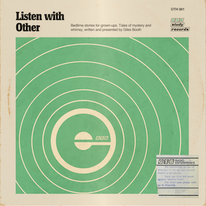

# Because grown-ups need story-time too.

### About this podcast

This podcast is an experiment to find a different outlet for my short stories, as well as finding a way to combine my love of mixing and editing audio with presenting. It carries no advertising, no sponsorship and is just for fun.

### About the author

Giles Booth was born in Bristol and grew up in North Somerset. He's a former BBC radio studio manager and teacher. He enjoys reading and writing short fiction. His 2008 novella for young adults *Constance Breakwater and her Beautiful Museumhood* is available as an eBook and paperback via Amazon.

## Series 1 - The Merry Milkmaids - coming soon

Kate's birthday fell just after new year so it was always a struggle finding people in the mood to party. Hoping to exorcise the memory of a disastrous birthday party five years ago, her husband lan books a getaway in rural Somerset. Unfinished business with Margate Louise, a friend they lost touch with, a storm called Arthur and a stone circle that is not what it seems, ensure that this new year and birthday do not go to plan...

***

Listen with Other is a GSB Radio Enterprises production.

&copy; 2025 Giles Booth.
